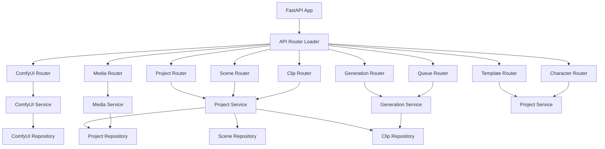

# Phase 2 Refactor Plan

## Objectives
1. Introduce layered backend architecture separating transport, service, and persistence concerns.
2. Implement repository abstractions for MongoDB collections to improve testability.
3. Standardize request/response payloads via DTO modules.
4. Version all API endpoints under `/api/v1` and reorganize routers accordingly.
5. Preserve existing functionality while enabling future extension (auth, security, etc.).

## Target Structure
```
backend/
├── api/
│   ├── __init__.py
│   └── v1/
│       ├── __init__.py
│       ├── comfyui_router.py
│       ├── projects_router.py
│       ├── media_router.py
│       ├── generation_router.py
│       ├── templates_router.py
│       ├── characters_router.py
│       └── queue_router.py
├── dtos/
│   ├── __init__.py
│   ├── comfyui_dtos.py
│   ├── project_dtos.py
│   ├── scene_dtos.py
│   ├── clip_dtos.py
│   ├── media_dtos.py
│   ├── generation_dtos.py
│   ├── template_dtos.py
│   ├── character_dtos.py
│   └── queue_dtos.py
├── repositories/
│   ├── __init__.py
│   ├── base_repository.py
│   ├── project_repository.py
│   ├── scene_repository.py
│   ├── clip_repository.py
│   └── comfyui_repository.py
└── services/
    ├── comfyui_service.py
    ├── generation_service.py
    ├── project_service.py
    ├── media_service.py
    └── __init__.py
```

## Layer Responsibilities
- [`backend/api/v1`](backend/api/v1/__init__.py): FastAPI routers handle HTTP concerns, map DTOs to service calls, and marshal responses.
- [`backend/services`](backend/services/__init__.py): Encapsulate business workflows, coordinate repositories, validators, and third-party clients.
- [`backend/repositories`](backend/repositories/__init__.py): Provide CRUD abstraction over Motor collections with reusable helpers in [`backend/repositories/base_repository.py`](backend/repositories/base_repository.py).
- [`backend/dtos`](backend/dtos/__init__.py): Pydantic models for transport (requests, responses, paginated payloads, metadata).

## Service Layer Design
- [`backend/services/project_service.py`](backend/services/project_service.py): Manage projects, scenes, clips (CRUD, timeline operations) leveraging repositories and validators.
- [`backend/services/comfyui_service.py`](backend/services/comfyui_service.py): Manage ComfyUI server registrations, status checks, and model catalog retrieval.
- [`backend/services/media_service.py`](backend/services/media_service.py): Handle file validation, storage, and metadata updates for music uploads, face assets.
- [`backend/services/generation_service.py`](backend/services/generation_service.py): Coordinate generation workflows, integrate [`backend/services/gallery_manager.py`](backend/services/gallery_manager.py), [`backend/services/batch_generator.py`](backend/services/batch_generator.py), and queueing.

## Repository Abstractions
- [`backend/repositories/base_repository.py`](backend/repositories/base_repository.py): Generic async CRUD helpers (create, find, update, delete) with projection and pagination support.
- [`backend/repositories/project_repository.py`](backend/repositories/project_repository.py): Project-specific queries (by id, list, update metadata).
- [`backend/repositories/scene_repository.py`](backend/repositories/scene_repository.py): Scene retrieval ordered by `order`, timeline helpers.
- [`backend/repositories/clip_repository.py`](backend/repositories/clip_repository.py): Clip operations (gallery updates, timeline adjustments).
- [`backend/repositories/comfyui_repository.py`](backend/repositories/comfyui_repository.py): CRUD on ComfyUI server entries.

## DTO Coverage (25+ Classes)
Each module will include create/update/request/response models. Examples:

- [`backend/dtos/project_dtos.py`](backend/dtos/project_dtos.py): `ProjectCreateDTO`, `ProjectUpdateDTO`, `ProjectResponseDTO`, `ProjectListResponseDTO`, `ProjectWithScenesDTO`.
- [`backend/dtos/scene_dtos.py`](backend/dtos/scene_dtos.py): `SceneCreateDTO`, `SceneUpdateDTO`, `SceneResponseDTO`, `SceneListResponseDTO`.
- [`backend/dtos/clip_dtos.py`](backend/dtos/clip_dtos.py): `ClipCreateDTO`, `ClipUpdateDTO`, `ClipResponseDTO`, `ClipTimelineUpdateDTO`, `ClipGalleryResponseDTO`.
- [`backend/dtos/comfyui_dtos.py`](backend/dtos/comfyui_dtos.py): `ComfyUIServerCreateDTO`, `ComfyUIServerDTO`, `ComfyUIServerInfoDTO`, `ModelDTO`.
- [`backend/dtos/generation_dtos.py`](backend/dtos/generation_dtos.py): `GenerationRequestDTO`, `GenerationResponseDTO`, `BatchGenerationRequestDTO`, `BatchStatusDTO`.
- [`backend/dtos/media_dtos.py`](backend/dtos/media_dtos.py): `UploadMusicResponseDTO`, `UploadFaceResponseDTO`.
- [`backend/dtos/template_dtos.py`](backend/dtos/template_dtos.py): `StyleTemplateCreateDTO`, `StyleTemplateUpdateDTO`, `StyleTemplateResponseDTO`, `StyleTemplateListResponseDTO`.
- [`backend/dtos/character_dtos.py`](backend/dtos/character_dtos.py): `CharacterCreateDTO`, `CharacterUpdateDTO`, `CharacterResponseDTO`, `CharacterListResponseDTO`.
- [`backend/dtos/queue_dtos.py`](backend/dtos/queue_dtos.py): `QueueJobRequestDTO`, `QueueJobResponseDTO`, `QueueStatusDTO`, `QueueServerRegistrationDTO`.

## API Versioning
- Replace current router registration with a versioned structure: `api_v1_router = APIRouter(prefix="/api/v1")`.
- [`backend/server.py`](backend/server.py) becomes composition root:
  - Initialize app, middleware, startup/shutdown hooks.
  - Include routers from [`backend/api/v1/__init__.py`](backend/api/v1/__init__.py).
  - Remove in-file models and endpoint implementations.

## Migration Strategy
1. **Introduce DTOs and repositories** while keeping existing server endpoints (adapter layer) to ensure imports resolve.
2. **Create services** that consume repositories and migrate logic from `server.py`.
3. **Split routers** by domain and map DTOs to service methods.
4. **Update `server.py`** to mount `/api/v1` router and delete legacy endpoint implementations/models.
5. **Adjust dependent services** (`gallery_manager`, `batch_generator`, `queue_manager`) to rely on DTOs/services instead of direct `backend.server` imports.
6. **Run formatting and linting** to maintain style consistency.
7. **Smoke test** critical endpoints and update documentation.

## Risks & Mitigations
- **Large refactor blast radius**: Introduce modules incrementally, maintain backwards-compatible return schemas until frontend updated.
- **Circular dependencies**: Ensure DTOs are pure schemas, services import repositories, routers import DTOs/services only.
- **Migration downtime**: Keep old logic until new routers verified, then remove legacy references.

## Deliverables
- New service/repository/DTO modules with full unit coverage forthcoming.
- Updated [`backend/server.py`](backend/server.py) reflecting lightweight composition root.
- Documentation updates (`README`, `PHASE_1_COMPLETION_SUMMARY`, etc.) capturing new endpoints and structure.

---

## Remaining Phase 2 Execution Plan (Routers, Docs, Verification)

### Goals
1. Split legacy `backend/server.py` endpoints into domain-specific routers under `backend/api/v1`.
2. Wire routers to the new service and repository layers via dependency injection.
3. Reduce `backend/server.py` to a composition root that mounts `/api/v1` and handles shared middleware, startup, and static mount logic.
4. Document the new architecture and ensure baseline verification of critical workflows.

### Work Breakdown Structure

1. **Router Scaffold**
   - Create `backend/api/v1/__init__.py` exporting `api_v1_router`.
   - Add router modules:
     - `comfyui_router.py`
     - `projects_router.py`
     - `scenes_router.py`
     - `clips_router.py`
     - `generation_router.py`
     - `media_router.py`
     - `templates_router.py`
     - `characters_router.py`
     - `queue_router.py`
     - `health_router.py`
   - Each router should:
     - Instantiate `APIRouter(prefix="...")`.
     - Depend on services defined in `dependencies.py`.
     - Map DTOs ↔ service responses.
     - Return existing JSON schemas to maintain frontend compatibility.

2. **Service Integration & Data Flow**
   - Replace direct `db` usage with service calls.
   - For file uploads, reuse `MediaService`; ensure `UploadFile` is passed correctly.
   - For generation endpoints, call `GenerationService` methods.
   - For batch and queue operations, delegate to existing services (`batch_generator`, `queue_manager`) via `GenerationService` or direct dependency injection helper functions.

3. **Composition Root Cleanup (`backend/server.py`)**
   - Remove model declarations and endpoint implementations.
   - Retain:
     - `FastAPI()` app creation.
     - Static file mount for `/uploads`.
     - CORS middleware configuration.
     - Startup/shutdown handlers for database manager.
   - Import `api_v1_router` and include with `app.include_router(api_v1_router, prefix="/api/v1")`.
   - Provide backwards-compatible root endpoint redirecting or delegating to `/api/v1`.

4. **Documentation & Configuration Updates**
   - Update `README.md` and `PHASE_1_COMPLETION_SUMMARY.md` with new API structure.
   - Add migration notes (`docs/phase2_router_migration.md` or similar) covering:
     - New module layout.
     - Dependency injection pattern.
     - Example request paths (e.g., `/api/v1/projects`).
   - Outline changes needed for future auth integration (e.g., router-level guards).

5. **Verification & Testing**
   - Smoke-test endpoints manually or via quick `httpie`/`curl` scripts:
     - `GET /api/v1/health`
     - CRUD cycle for projects/scenes/clips.
     - Generation stub (mock or happy path).
     - Queue registration and status.
   - Ensure static uploads still accessible.
   - Record outcomes in `test_result.md` or new `verification_logs/phase2.md`.

### Sequencing

1. **Phase 2.1 – Router Files**
   - Scaffold files and import DTOs/services.
   - Port logic from `server.py` in small batches (e.g., ComfyUI + health first).
2. **Phase 2.2 – Server Composition Cleanup**
   - Remove duplicated models.
   - Ensure dependency injection resolves without circular imports.
3. **Phase 2.3 – Docs & Guides**
   - Update docs after verifying new paths.
4. **Phase 2.4 – Verification Run**
   - Execute smoke tests.
   - Capture results and any follow-up tickets.

### Mermaid Overview



### Risk Mitigation & Notes
- **Regression Risk**: Maintain identical response payloads; add integration test scripts before removing legacy endpoints.
- **Circular Imports**: Routers import services via dependency helpers only; services import repositories/DTOs; repositories avoid router imports.
- **Auth Placeholder**: Reserve `dependencies.py` hooks for future security dependencies.
- **Deployment**: After refactor, new release should bump API minor version to highlight path change.

### Deliverables
- Router modules with consistent dependency injection and DTO usage.
- Light `backend/server.py` composition root.
- Updated documentation and verification report.
- Todo list updates reflecting progress toward tasks 6–8.
